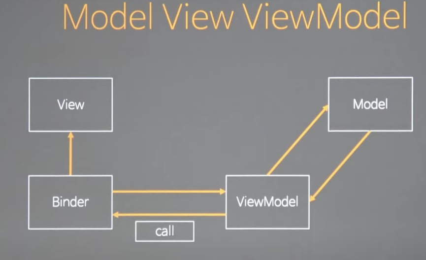

[👈 이전으로](../README.md)

#### 들어가기전

[MVC와 MVP](./mvc_mvp.md)

### MVVM (Model + View + View Model) 패턴

- 뷰
  - UI에 관련된 것
- 뷰 모델
  - 뷰 모델이 뷰를 알고있으면 안된다. (mvvm의 목표)
  - 바인더를 통해 변화를 감지하여 뷰모델의 변경을 뷰에 반영하거나 뷰의 변화를 뷰모델에 반영한다.
    - 바인더가 뷰모델을 observe 또는
    - 뷰모델에 바인더를 연결하여 변화가 생기면 call
- 모델
  - 앱에서 사용하는 데이터에 관한 행위를 다루는 것

#### 핵심 - Binder

ViewModel이 뷰에 그림을 그리는 로직을 Binder 위임함 -> 그림을 그린다는 제어를 역전시킴

- MVVM을 많이 쓰는 이유 - 뷰를 그리는 제어구문이 바인더에 집중되어있기 때문

- Vue, Angular 방식 - 있는 뷰를 스캔함

  - 모델과 뷰를 따로 관리
  - 단위테스트를 하기 매우 쉽다 (돔을 직접 가져와 테스트할 필요가 없고 뷰모델만 갱신하여 잘 갱신 되었는지만 확인하면 됨)

- React 방식 - 데이터와 연결 된 뷰를 만들어서 삽입함

  - 모델과 뷰를 합쳐서 관리

#### 구현

View Model <- Binder <- Scanner -> HTMLElement

##### 코드를 분리하는 첫번째 원칙

- 변화율 - 코드를 바꾸는 이유가 같은지 (시간이 아니라 원인에 따른 변화율) = SRP
  - Binder - 뷰모델을 통해 뷰를 그릴때의 로직
  - Scanner - HTML을 해석하는 방법을 바꿀때

> 출처) 코드스피츠 86 https://youtu.be/RT38Za1pkdI
